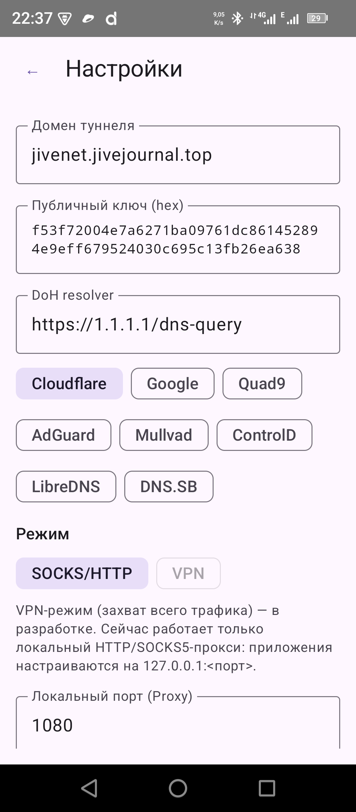
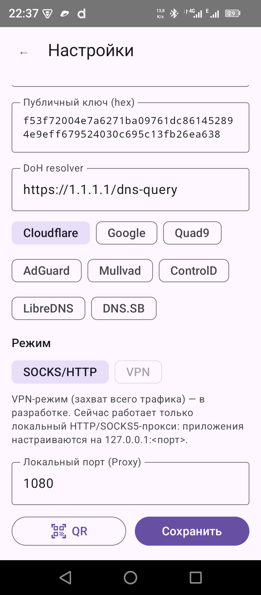
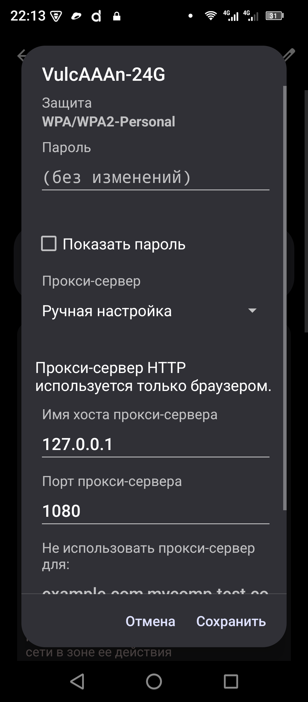

# Настройка прокси на Android

После того как в приложении `jivenet` нажали «Подключить», локальный HTTP/SOCKS5 прокси поднят на `127.0.0.1:1080`. Этот документ — о том, как направить трафик телефона в этот прокси.

Экран настроек приложения (для справки):

<table>
  <tr>
    <td></td>
    <td></td>
  </tr>
</table>

## Способ 1. Системный HTTP-прокси в настройках Wi-Fi (рекомендуется)

Android не поддерживает SOCKS5 на уровне ОС, но поддерживает HTTP-прокси — **per-WiFi** (отдельно для каждой сети). 3proxy на сервере работает в auto-mode, принимает HTTP как SOCKS5, всё работает.

### Стоковый AOSP / Pixel / Oukitel / большинство OEM (Android 12–15)

1. **Настройки → Сеть и Интернет → Интернет** (в старых — «Wi-Fi»).
2. Тапнуть **на имя подключенной сети** (не на шестерёнку рядом — она не та).
3. Откроется экран **«Сведения о сети»** / «Network details».
4. Справа сверху — **иконка карандаша ✎** («Изменить» / «Edit»). Тапнуть.
5. В открывшейся форме среди полей найти **«Прокси-сервер»** / «Proxy». На стоковом Android 15 оно видно сразу; на старых версиях и некоторых OEM — внутри свернутого блока **«Расширенные настройки»** / «Advanced options», который нужно раскрыть.
6. Выбрать **«Ручная настройка»** / «Manual».
7. Заполнить:
   - **Имя хоста прокси-сервера**: `127.0.0.1`
   - **Порт прокси-сервера**: `1080`
   - «Не использовать прокси-сервер для» — оставить пустым или по умолчанию.
8. **«Сохранить»**.

Эталонный экран (Oukitel WP300, Android 15):



Проверить: в Chrome открыть `https://ifconfig.co` — должен показать IP вашего VPS.

### Samsung (One UI)

1. Настройки → Подключения → Wi-Fi.
2. Шестерёнка ⚙ у активной сети.
3. **«Просмотреть больше»** / «View more» (раскрыть).
4. Proxy → Manual → вписать `127.0.0.1:1080` → Save.

### Xiaomi / Redmi / POCO (MIUI, HyperOS)

1. Настройки → Wi-Fi.
2. Стрелка `>` или «Тап для деталей» у активной сети.
3. В самом низу — **Proxy** → Manual → `127.0.0.1:1080` → Save.
   Иногда спрятано в **«Advanced settings»** / «Дополнительные настройки».

### Huawei (EMUI / HarmonyOS)

1. Настройки → Wi-Fi → долгое нажатие на имя сети → **«Изменить сеть»** / «Modify network».
2. Раскрыть **«Показать дополнительные параметры»** / «Show advanced options».
3. Proxy → Manual.

### Общий признак: ищите «Advanced» в форме редактирования сети

Если на вашем устройстве этого пункта не видно — ищите в **форме редактирования сети** (не в «деталях») раскрывающийся раздел **«Advanced»** / **«Расширенные настройки»**. В 99% случаев proxy-поле там.

## Способ 2. Глобальный прокси через adb (если в UI не нашли)

Работает без root на **любом** Android. Настройка применяется ко всему устройству (для всех сетей: Wi-Fi, мобильная). Требует компьютер с `adb` и включённую USB-отладку.

```bash
# Включить
adb shell settings put global http_proxy 127.0.0.1:1080

# Проверить текущее значение
adb shell settings get global http_proxy
# → должно быть:  127.0.0.1:1080

# Выключить (любой из трёх эквивалентных вариантов):
adb shell settings put global http_proxy :0
adb shell settings put global http_proxy ""
adb shell settings delete global http_proxy
```

Проверка что прокси действительно снят:

```bash
adb shell settings get global http_proxy
# → :0     (после put :0 или put "")
# → null   (после delete)
```

Любое из этих значений — отсутствие прокси. Android одинаково интерпретирует «null», пустую строку и `:0`.

**Нюансы:**

- На некоторых сборках глобальный прокси **сбрасывается после перезагрузки** — надо ставить заново.
- Если одновременно задан и глобальный, и per-Wi-Fi — per-Wi-Fi имеет приоритет.
- Есть отдельный параметр `settings put system http_proxy` — устаревший, не используйте его.
- После выключения прокси **закройте и откройте Chrome** (или очистите его Network service) — браузер может кешировать настройку прокси на уровне процесса и продолжать слать запросы в 127.0.0.1:1080 какое-то время.

## Способ 3. SocksDroid — глобальный прокси **без adb и без root** ★

Это главное решение для **мобильных сетей** (LTE/5G/EDGE), где Способ 1 (per-Wi-Fi GUI) не применим, а Способ 2 (adb) требует компьютера.

### SocksDroid (VPN-service → SOCKS5)

На мобильной сети Android **не даёт настроить HTTP-прокси в интерфейсе** (настройка прокси — только per-Wi-Fi). [**SocksDroid**](https://f-droid.org/packages/net.typeblog.socks/) решает это: поднимает локальный VPN-сервис и маршрутизирует TCP-трафик в SOCKS5-прокси. Android просит обычное разрешение на VPN (как и для любого VPN-клиента), root не нужен.

#### Пошагово

1. **Установить SocksDroid.** Не используется лого Google Play; берите из [F-Droid](https://f-droid.org/packages/net.typeblog.socks/) (открытый код) или напрямую APK с [GitHub](https://github.com/bndeff/socksdroid/releases).

2. **Открыть → New Profile.** Заполнить:
   - **Profile name:** `jivenet`
   - **Server IP:** `127.0.0.1`
   - **Server Port:** `1080`
   - **Username / Password:** оставить пустым
   - **DNS:** `1.1.1.1` (или любой другой; он используется для резолва имён **внутри** туннеля, не наружу).
   - **Bypass LAN:** `Yes` — не туннелировать локальную сеть (192.168.x, 10.x).

3. **Обязательно: исключить `jivenet` из туннеля SocksDroid.**

   Иначе получится петля: dnstt-client внутри jivenet шлёт UDP-пакеты на DNS оператора (`10.152.222.141:53`), SocksDroid захватит их и попытается направить в SOCKS5 (127.0.0.1:1080) — а там сам же dnstt-client их ждёт. Deadlock.

   В SocksDroid: **Per-App Proxy → Mode: Bypass selected apps → отметить `jivenet` (debug).**

   Также в «bypass» полезно добавить приложения, которым вообще прокси не нужен: MMS/SMS, Google Services Framework (для push-уведомлений).

4. **Сохранить** → нажать **Connect** в SocksDroid. Android покажет запрос на VPN → «Разрешить».

5. В статусной панели появится иконка ключа (VPN активен). Весь трафик (кроме jivenet) идёт через SocksDroid → dnstt-client → туннель → 3proxy на сервере → интернет.

#### Запуск в правильном порядке

Каждый раз при подключении к мобильной сети:

1. Сначала **Подключить** в приложении **jivenet** (чтобы `127.0.0.1:1080` начал слушать).
2. Затем **Connect** в **SocksDroid**.

Отключать в обратном порядке.

#### Проверка

- В Chrome `https://ifconfig.co` → IP вашего VPS.
- В `https://dnsleaktest.com` → Standard test → видны только DNS сервера Cloudflare (или настроенный в SocksDroid DNS) внутри туннеля.

## Способ 4. Настройка прокси в отдельных приложениях

Если SocksDroid не подошёл (или VPN-иконка в статусе мешает), — настройте прокси **только в приложениях, которые умеют это сами** (тогда не нужен ни adb, ни VPN-service):

### Firefox Android (только браузерный трафик)

1. **Firefox Android** (не Firefox Focus) → Настройки → «Network Settings» / «Сетевые настройки».
2. Manual Proxy Configuration:
   - SOCKS Host: `127.0.0.1`, Port: `1080`, **SOCKS v5**.
3. Включить «Proxy DNS when using SOCKS v5» — DNS-запросы тоже через туннель.

С расширением **FoxyProxy Basic** — удобнее переключать профили.

### Telegram

Настройки → Данные и память → Настройки прокси → **Добавить прокси** → SOCKS5 → `127.0.0.1:1080`.

### ProxyDroid (root)

Есть в F-Droid. **Требует root.** Не создаёт VPN-иконку, проще в некоторых сценариях. Для не-root устройств — SocksDroid выше.

## Проверка

После настройки любым способом откройте в Chrome/браузере:

- `https://ifconfig.co` — IP должен соответствовать вашему VPS.
- `https://dnsleaktest.com/` → «Standard test» — должны быть только DNS-серверы Cloudflare/Google (зависит от конфигурации 3proxy).

Если IP всё тот же «домашний» — прокси не применился; проверьте:

1. Действительно ли в Chrome активна та Wi-Fi сеть, для которой вы прописали прокси.
2. В приложении jivenet — статус «Подключено».
3. На сервере `sudo journalctl -u 3proxy -f` видны ли CONNECT-запросы.

## Когда ничего не работает

См. [`../server/docs/TROUBLESHOOTING.md`](../server/docs/TROUBLESHOOTING.md) → раздел «На Android подключено, но браузер не ходит».
